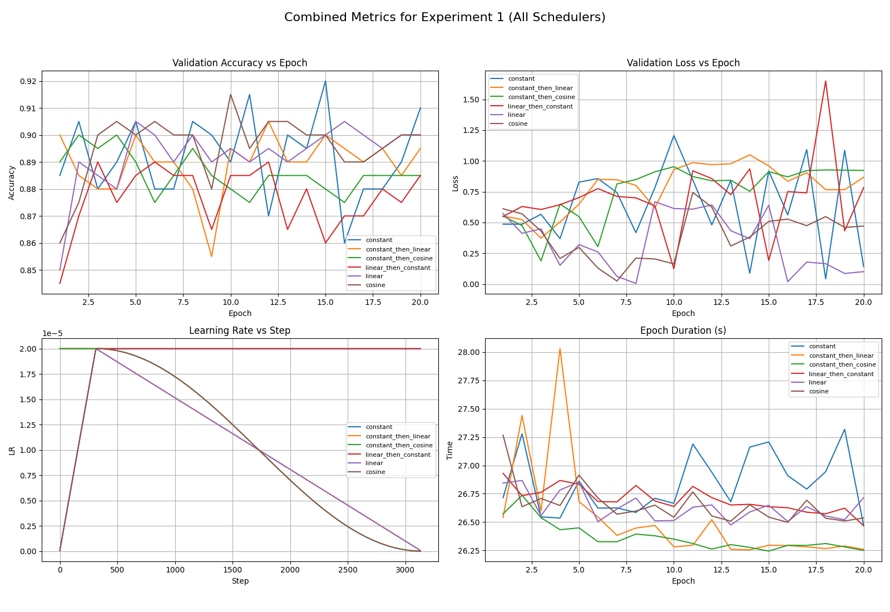
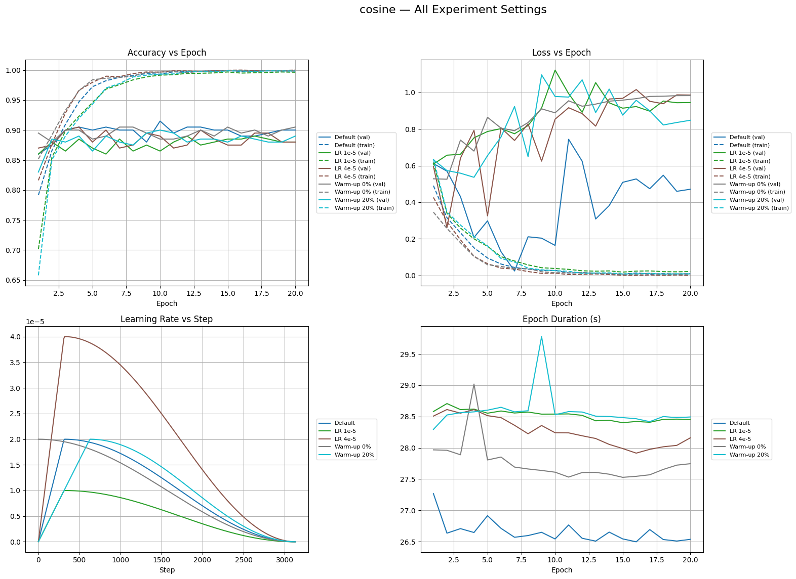

# Learning Rate Scheduler Strategies in NLP: DistilBERT on IMDB

โปรเจครายวิชา **FRA501 Natural Language Processing with Deep Learning**
เปรียบเทียบ learning rate scheduler หลายแบบตอน fine-tune `distilbert-base-uncased` สำหรับ sentiment classification (positive / negative) บน IMDB Movie Reviews

> English summary: 27 fine-tuning runs of DistilBERT on a 10k-sample IMDB subset, varying the LR schedule (6 families), peak learning rate (1e-5 / 2e-5 / 4e-5) and warm-up length (0% / 10% / 20%). All logs and plots are included; model checkpoints are not. The differences between schedulers are small and within the noise of a 200-sample validation set (see [Findings](#ผลที่ได้) and [Known issues](#known-issues)).

โปรเจคนี้เป็นงานเก่า เก็บขึ้น GitHub เพื่อเป็นบันทึกการทดลอง ตัวโค้ดอยู่ใน notebook เดียว (เขียนสำหรับ Google Colab)

## โครงสร้าง repo

```
notebook/
  FRA501_LR_Scheduler_IMDB.ipynb   โค้ดทั้งหมด: EDA, preprocess, training, plot (137 cells)
results/
  all_runs.csv                     ตารางสรุปทั้ง 27 runs (คำนวณจาก training_summary ของแต่ละ run)
  runs/<run_name>/                 27 โฟลเดอร์ ต่อ run: training_summary_*.csv, lr_logs_*.csv
                                   (6 run ตั้งต้นมี plot_*.png ติดมาด้วย)
  graphs/
    exp1/                          เทียบ scheduler ทั้ง 6 แบบ (LR 2e-5, warm-up 10%)
    exp2/                          เทียบ LR 1e-5 / 2e-5 / 4e-5
    exp3/                          เทียบ warm-up 0% / 10% / 20%
    all_exp_compare/               รวมทุกการตั้งค่าของ scheduler เดียวกันในภาพเดียว
  legacy/warmup_20_percent_plots/  กราฟจากรอบทดลองแรก (พ.ค. 2025) ไม่ได้ใช้ในรายงานรอบสุดท้าย
```

หมายเหตุเรื่องเลข exp: ใน notebook เรียก "การทดลองที่ 1" = ปรับ LR และ "การทดลองที่ 2" = ปรับ warm-up แต่ชื่อโฟลเดอร์กราฟใช้ `exp1` = baseline, `exp2` = LR, `exp3` = warm-up

## Dataset และการเตรียมข้อมูล

- [IMDB Dataset of 50K Movie Reviews](https://www.kaggle.com/datasets/lakshmi25npathi/imdb-dataset-of-50k-movie-reviews) (Kaggle, โหลดผ่าน `kagglehub`) สมดุล 25,000 positive / 25,000 negative
- ลบรีวิวซ้ำ (`drop_duplicates` บน `review`)
- ตัด outlier ตามความยาว: เก็บ z-score ของจำนวนคำในช่วง -2 ถึง +2 และอย่างน้อย 10 คำ
- ล้างข้อความ: ลบลิงก์, `@mention`, `#hashtag` และ punctuation ทุกตัว (ไม่ตัด stopword เพราะ BERT ใช้บริบทเหล่านั้น)
- label: negative = 0, positive = 1
- แบ่งข้อมูลแบบ balanced: **train 10,000** (5,000/5,000), **val 200** (100/100), **test 200** (100/100), `random_state=42`
- Tokenize ด้วย `DistilBertTokenizerFast`, `max_length=128`, truncation + padding

## การตั้งค่าการเทรน

| รายการ | ค่า |
|---|---|
| โมเดล | `DistilBertForSequenceClassification` (`distilbert-base-uncased`, 2 labels) |
| Optimizer | AdamW (`weight_decay` ค่า default) |
| Loss | CrossEntropyLoss |
| Batch size | 64 (157 steps/epoch, รวม 3,140 steps) |
| Epochs | 20 |
| Precision | mixed precision (autocast + GradScaler) เมื่อมี CUDA |
| ที่ log | train/val loss, acc ต่อ epoch, เวลา/epoch, LR ทุก 10 steps |

### Scheduler ที่เทียบ (ทุกแบบใช้ `LambdaLR` เขียนเอง)

| ชื่อ run | ช่วง warm-up | ช่วง decay |
|---|---|---|
| `constant` | ไม่มี scheduler | คงที่ |
| `constant_then_linear` | LR คงที่ที่ค่า peak | linear ลงถึง 0 |
| `constant_then_cosine` | LR คงที่ที่ค่า peak | cosine ลงถึง 0 |
| `linear_then_constant` | linear 0 -> peak | คงที่ |
| `linear` | linear 0 -> peak | linear ลงถึง 0 |
| `cosine` | linear 0 -> peak | cosine ลงถึง 0 |

"constant warm-up" ในที่นี้หมายถึงถือ LR ไว้ที่ peak ตลอดช่วง N% แรก แล้วค่อยเริ่ม decay (ไม่ได้ไต่ขึ้นจาก 0)

### ชุดการทดลอง (รวม 27 runs)

| ชุด | ตั้งค่า | จำนวน run |
|---|---|---|
| Baseline | LR 2e-5, warm-up 10%, 6 scheduler | 6 |
| ปรับ LR | LR 1e-5 และ 4e-5, warm-up 10%, 6 scheduler | 12 |
| Warm-up 0% | LR 2e-5; `constant`, `linear`, `cosine` | 3 |
| Warm-up 20% | LR 2e-5; 5 scheduler (ไม่มี `constant`) + 1 run ซ้ำ (ดูข้างล่าง) | 6 |

ชื่อโฟลเดอร์ `*_lr1e5`, `*_lr4e5`, `*_warm0`, `*_warm20` บอกชุดการทดลอง ส่วนชื่อที่ไม่มี suffix คือ baseline
`linear_then_cosine_warm20` ไม่ได้มาจากลูปใน notebook แต่ LR log เหมือน `cosine_warm20` ทุกค่า (ต่างแค่การปัดเศษทศนิยม) จึงเป็นการรันซ้ำ config เดียวกันภายใต้ชื่อเก่า

## ผลที่ได้

ตัวเลขทั้งหมดคำนวณจาก `results/runs/*/training_summary_*.csv` ("best val acc" = ค่าสูงสุดตลอด 20 epochs บน val 200 ตัวอย่าง)

**ค่าเฉลี่ย best val acc ตามกลุ่ม**

| กลุ่ม | จำนวน run | เฉลี่ย | ต่ำสุด - สูงสุด |
|---|---|---|---|
| LR 1e-5 (6 scheduler) | 6 | 0.895 | 0.890 - 0.900 |
| LR 2e-5 (6 scheduler) | 6 | 0.906 | 0.890 - 0.920 |
| LR 4e-5 (6 scheduler) | 6 | 0.913 | 0.905 - 0.935 |
| warm-up 0% (3 scheduler) | 3 | 0.902 | 0.895 - 0.905 |
| warm-up 10% (scheduler เดียวกัน 3 ตัว) | 3 | 0.913 | 0.905 - 0.920 |
| warm-up 20% (5 scheduler) | 5 | 0.904 | 0.900 - 0.915 |

**ค่าเฉลี่ยตาม scheduler (รวม 3 ค่า LR)**: constant 0.912, linear_then_constant 0.908, constant_then_linear 0.903, cosine 0.903, linear 0.902, constant_then_cosine 0.900

**run ที่ val acc สูงสุด**: `linear_then_constant_lr4e5` 0.935 (epoch 12), `constant` 0.920, แล้ว `constant_then_cosine_warm20`, `constant_lr4e5`, `cosine` ที่ 0.915

ภาพรวม:





### อ่านผลอย่างไรให้ถูก

- val set มี 200 ตัวอย่าง ที่ accuracy ราว 0.90 ค่า standard error อยู่ที่ประมาณ 2 จุด % และ 1 ตัวอย่างเท่ากับ 0.5 จุด % ส่วนต่างระหว่าง scheduler (ไม่เกิน ~2 จุด %) **อยู่ในระดับ noise** จึงสรุปไม่ได้ว่า scheduler ตัวไหนดีกว่าตัวอื่นจากข้อมูลชุดนี้
- สัญญาณที่ชัดที่สุดคือ LR 1e-5 ต่ำกว่า 4e-5 เล็กน้อยในทุก scheduler (เฉลี่ย 0.895 กับ 0.913) แต่ยังเป็นผลจาก run เดียวต่อการตั้งค่า
- มีคู่ที่รัน config เดียวกันสองครั้ง (`cosine_warm20` กับ `linear_then_cosine_warm20`) ได้ best val acc เท่ากันที่ 0.900 แต่ final val loss ต่างกัน 0.848 กับ 0.588 ซึ่งบอกว่า run-to-run variance สูงพอจะกลบความต่างระหว่าง scheduler
- ทุก run มี train acc สูงสุดตั้งแต่ 99.7% ขึ้นไป (ในกราฟ baseline ถึง 0.99+ ราว epoch 8 - 10) ขณะที่ val acc แกว่งอยู่ราว 0.85 - 0.93 ตั้งแต่ epoch แรก ๆ แปลว่าโมเดลเริ่ม overfit ชุด train 10k เร็ว และ scheduler เปลี่ยนผลปลายทางได้น้อย
- เวลาเทรนรวมต่อ run อยู่ที่ราว 527 - 581 วินาที (Colab GPU) ความต่างระหว่างกลุ่มมาจากเครื่อง/โหลดของ Colab ไม่ใช่ตัว scheduler
- การวิเคราะห์เชิงเนื้อหาฉบับเต็มอยู่ในรายงานรายวิชา ซึ่งไม่ได้อยู่ใน repo นี้

## Known issues

ข้อนี้ได้จากการอ่านโค้ด notebook ตอนเตรียม repo (ยังไม่ได้รันซ้ำ):

1. **test set ไม่เคยถูกใช้**: สร้าง `test_loader` (200 ตัวอย่าง) ไว้แต่ไม่มีการประเมินผลบนมัน ตัวเลขทั้งหมดเป็น validation accuracy ที่เลือกค่าสูงสุดข้าม epoch จึงมี selection bias
2. **`val_loss` มาจาก batch สุดท้ายเท่านั้น**: หลังลูป validation เรียก `loss_fn(outputs.logits, labels)` กับ batch ล่าสุด ซึ่งมีแค่ 8 ตัวอย่าง (200 = 64+64+64+8) ค่า val loss ในไฟล์ CSV และกราฟจึงแกว่งมากและไม่ควรเอามาเทียบเชิงปริมาณ (accuracy คิดจากทั้ง 200 ตัวอย่างถูกต้อง)
3. **best checkpoint อาจไม่ใช่ epoch ที่ดีที่สุด**: `best_model_state_dict = model.state_dict()` ไม่ได้ `deepcopy` ใน PyTorch tensor ที่ได้ใช้ storage ร่วมกับพารามิเตอร์จริง ไฟล์ `.pt` ที่บันทึกจึงน่าจะเป็นน้ำหนักของ epoch สุดท้าย
4. **ไม่ได้ตั้ง random seed** ให้โมเดล (classifier head), dropout และ DataLoader shuffle (ตั้ง `random_state=42` เฉพาะตอนแบ่งข้อมูล) และมีแค่ 1 run ต่อการตั้งค่า
5. train acc/loss ที่ log เป็นค่าเฉลี่ยของ 100 batch ล่าสุดใน epoch (`deque(maxlen=100)`) ไม่ใช่ทั้ง epoch
6. ข้อความใน markdown บางส่วนไม่ตรงกับโค้ด เช่น เขียนว่า "10000 train และ 400 test" แต่จริงคือ val 200 + test 200
7. Path ผูกกับ Colab: `base_dir = "/content/drive/MyDrive/2-67/FRA501/Project"` และ `from google.colab import drive`

## ถ้าต้องการรันซ้ำ

1. เปิด `notebook/FRA501_LR_Scheduler_IMDB.ipynb` ใน Google Colab (ต้องมี GPU เพื่อให้ได้เวลาใกล้เคียงเดิม)
2. ติดตั้ง/ใช้แพ็กเกจ: `torch`, `transformers`, `datasets`, `kagglehub`, `pandas`, `scikit-learn`, `scipy`, `seaborn`, `matplotlib`, `tqdm` (ไม่ได้ pin เวอร์ชันไว้ใน notebook)
3. เตรียม Kaggle credential สำหรับ `kagglehub` และ mount Google Drive แก้ `base_dir` ให้ชี้ที่ที่ต้องการเก็บผล
4. รันตามลำดับ cell: preprocess -> `train_model_lr` -> บล็อกการทดลอง (baseline, LR, warm-up) -> cell plot

ไม่ได้รวมไฟล์น้ำหนักโมเดล (`model_<run>.pt` 27 ไฟล์ ไฟล์ละ ~255 MB รวม ~6.9 GB) ไว้ใน repo เพราะเกินขีดจำกัดของ GitHub ถ้าต้องการต้องรันเทรนใหม่
